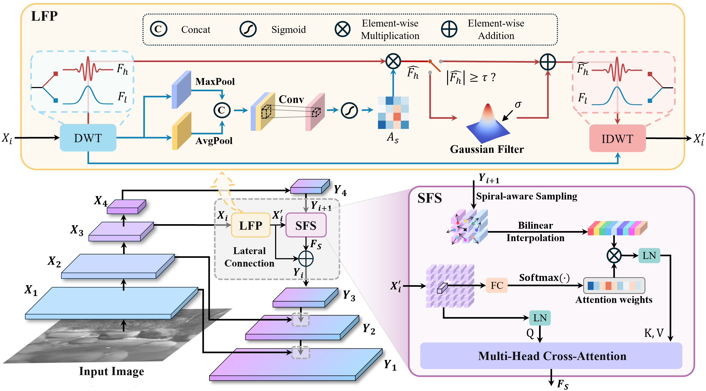
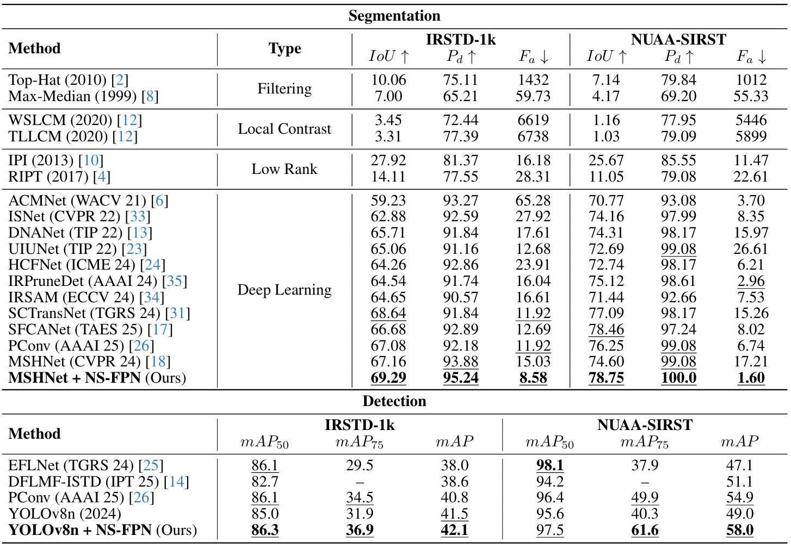
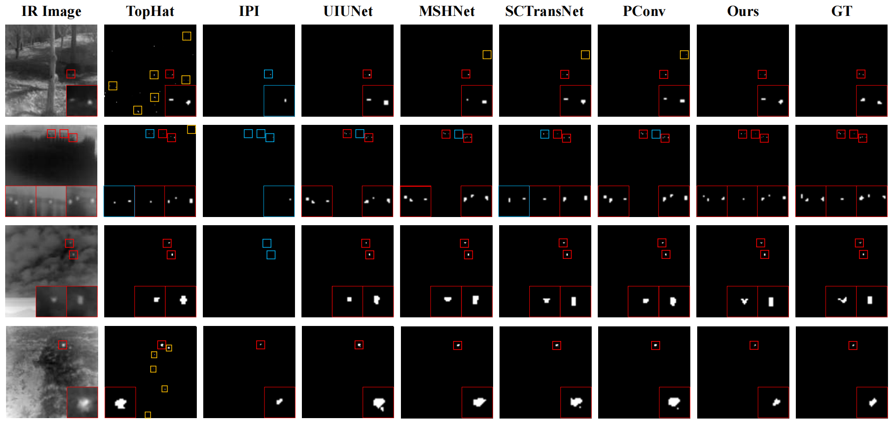

 <h1 align="center">Seeing Through the Noise: Improving Infrared Small Target Detection and Segmentation from Noise Suppression Perspective</h1>
  

    <b> CVPR, 2026 </b>
     
    <a href="https://yuanmaoxun.github.io/"><strong>Maoxun Yuan </strong></a> 
    ·
    <a href=""><strong>Duanni Meng </strong></a>
    ·
    <a href=""><strong>Ziteng Xi </strong></a>
    ·
    <a href="https://github.com/Zhao-Tian-yi"><strong>Tianyi Zhao </strong></a>
    ·
    <a href="https://zhaoshiji123.github.io/"><strong>Shiji Zhao </strong></a>
      ·
    <a href="https://scholar.google.com.hk/citations?user=y5Ov6VAAAAAJ&hl=zh-CN&oi=ao"><strong>Yimian Dai </strong></a>
      ·
    <a href="https://sites.google.com/site/xingxingwei1988/"><strong>Xingxing Wei </strong></a>
  

This repository is the official implementation of our paper Seeing Through the Noise: Improving Infrared Small Target Detection and Segmentation from Noise Suppression Perspective.

## Overview

    

## Introduction

Infrared small target detection and segmentation (IRSTDS) is a critical yet challenging task in defense and civilian applications, owing to the dim, shapeless appearance of targets and severe background clutter. Recent CNN-based methods have achieved promising target perception results, but they only focus on enhancing feature representation to offset the impact of noise, which results in the increased false alarm problem. In this paper, through analyzing the problem from the frequency domain, we pioneer in improving performance from noise suppression perspective and propose a novel noise-suppression feature pyramid network (NS-FPN), which integrates a low-frequency guided feature purification (LFP) module and a spiral-aware feature sampling (SFS) module into the original FPN structure. The LFP module suppresses the noise features by purifying high-frequency components to achieve feature enhancement devoid of noise interference, while the SFS module further adopts spiral sampling to fuse target-relevant features in feature fusion process. Our NS-FPN is designed to be lightweight yet effective and can be easily plugged into existing IRSTDS frameworks. Extensive experiments on the IRSTD-1k and NUAA-SIRST datasets demonstrate that our method significantly reduces false alarms and achieves superior performance on IRSTDS task.

## Quantitative Results

    

## Visual Results

    

## TODO

- [ ] Release the core codes recently.
